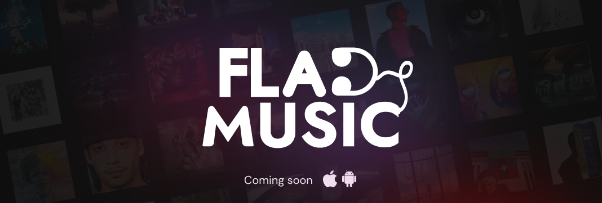
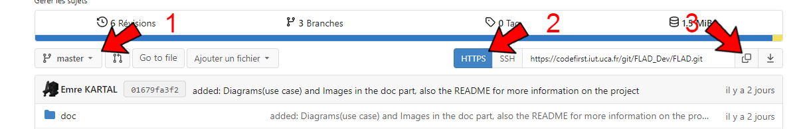
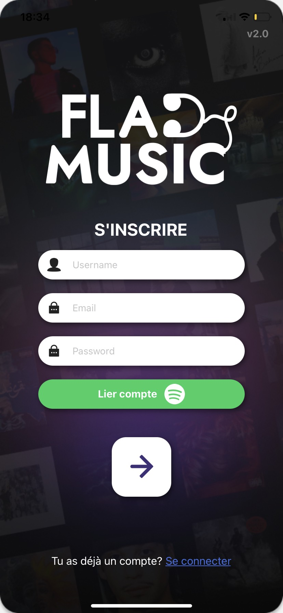

<div align = center>



</div>

**Nom de l’application** : FLAD :musical_note:
</br>

**Thème de l’application** :  Il s'agit d'un réseau social cross-plateforme axé sur la musique et destiné aux utilisateurs de terminaux mobiles. Son objectif est de permettre aux utilisateurs situés à moins de 100 mètres les uns des autres de visualiser les musiques écoutées par chacun. Ils pourront faire connaissance grâce à un chat et, qui sait, devenir amis. :grin:
</br>

**Contexte** : 👇
</br>

:information_source: Ce projet est un travail universitaire pour la deuxième année du B.U.T Informatique de Clermont-Ferrand. 

## Répartition du Gitlab

La racine de notre gitlab est composée de deux dossiers essentiels au projet:

[**src**](src) : **Toute la partie codage de l'application mobile** (contient un dossier API pour l'API FLAD qui effectue les requêtes vers l'API SPOTIFY et la base de données, ainsi qu'un dossier FLAD qui contient toute la partie côté client de l'application)

[**doc**](doc) : **Documentation de l'application** 

## Fonctionnement

- ### Comment lancer le projet ? 

Tout d'abord si ce n'est pas fait cloner le dépôt de la branche **master/main**, pour cela copier le lien URL du dépôt git :

<div align = center>



</div>

Puis, dans un terminal dans le répertoire que vous souhaiter taper la commande : **git clone https://codefirst.iut.uca.fr/git/FLAD_Dev/FLAD.git**

Ensuite dans un terminal, assurer vous que vous possédez node.js, pour cela il existe la commande : **npm -v**


:information_source: *Si vous ne disposez pas de node.js, allé sur le site [Download Node.js](https://nodejs.org/en/download/) pour pouvoir le télécharger, vous pouvez aussi utiliser nvm qui est un outil de gestion des versions de Node.js sur votre appareil, pour en savoir plus il existe le site [Guide NVM](https://www.freecodecamp.org/news/node-version-manager-nvm-install-guide/) !!!*
<br>

Pour la suite, il suffit seulement de vérifier que node.js est à jour et installer le client expo-cli via la commande : **npm install expo-cli** 

Maintenant vous pouvez à tout moment lancer l'application grâce à la commande : **npx expo start :sunglasses:**
<br>
:information_source: *Cliquer sur la touche 'w' si vous voulez le visualiser sur un navigateur (ce que je ne conseille pas) ou installer l'application 'Expo go' de votre téléphone et scanner le QR code proposer pour le visualiser (à noter que l'ordinateur dans lequel il se voit lancer doit être dans le même réseau local que votre téléphone)*

- ### Comment le lancer à partir de l'iut d'Aubière ?

Cela est un peu plus difficile mais faisable !!!
<br>
Tout d'abord aller dans votre compte scratch : **cd home/scratch/compte**

Puis récupérer votre adresse IP via la commande : **echo $http_proxy**

Exemple : http://193.49.118.36:8080

Maintenant aller dans le fichier ~/.npmrc (**vim ~/.npmrc**) et noter les informations suivantes (bien entendu remplacer l'IP ci-dessous par l'IP que vous avez récupérer juste avant) :

``` bash
proxy=http://193.49.118.36:8080
http_proxy=http://193.49.118.36:8080
https_proxy=http://193.49.118.36:8080
cache=/home/scratch/compte/npmcache
```

Puis installer le client expo-cli via la commande : **npm install expo-cli**

Et entrer la commande : **export NODE_OPTIONS=--openssl-legacy-provider**

Maintenant vous pouvez à tout moment lancer l'application grâce à la commande : **npx expo start :sunglasses:**
<br>
:information_source: *Cliquer sur la touche 'w' si vous voulez le visualiser sur un navigateur (ce que je ne conseille pas) ou installer l'application 'Expo go' de votre téléphone et scanner le QR code proposer pour le visualiser (à noter que l'ordinateur dans lequel il se voit lancer doit être dans le même réseau local que votre téléphone)*

- ### Comment s'inscrire sur l'application ? 

Tout d'abord, il faut fournir votre *adresse e-mail* et votre *nom Spotify* aux **techniciens de l'application** (voir plus bas). Ils s'occuperont de vous ajouter définitivement à l'application. Une fois que cela est fait, inscrivez-vous via la **page d'inscription** de l'application en cliquant d'abord sur le bouton 'lier mon compte':

<div align = center>



</div>


Vous serez normalement redirigé sur la page Spotify où vous devrez vous connecter. Une fois connecté, entrez votre nom, votre adresse e-mail et votre mot de passe en tant qu'utilisateur FLAD (n'oubliez pas ces informations car vous en aurez besoin pour vous connecter). Ensuite, cliquez sur le bouton 'suivant' et bienvenue sur l'application !

## Environnement de Travail

Notre environnement de travail se base sur plusieurs outils et langages :👇

<div align = center>

---

&nbsp; 
&nbsp; 
&nbsp; 
&nbsp; 

---

</div>

## Deploiement
- [x] &nbsp; 
- [x] &nbsp; 


## Technicien en charge de l'application

La composition pour le projet se voit réaliser par deux élèves de l'IUT d'Aubière:
<br>
⚙️ Emre KARTAL : emre.kartal@etu.uca.fr
<br>
⚙️ David D'ALMEIDA : david.d_almeida@etu.uca.fr

<div align = center>
© PM2 (Projet inspiré par nos très chers développeurs de la Dafl Team (S.O les Dafl dev))
</div>
